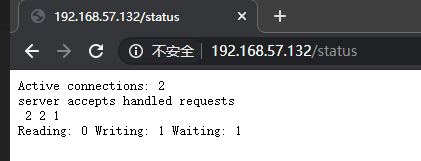

# Nginx网站服务

本章节主要目的是配置Nginx成为一个网站server

## 1. 安装Nginx

yum安装或者编译安装均可以

## 2. 调整配置文件

在Nginx服务器的主配置文件/usr/local/nginx/conf/nginx.conf中，包括全局配置、I/O事件配置和HTTP配置这三大块内容，配置语句的格式为"指令  值；" (末尾以分号表示结束)，以 " # " 开始的部分表示注释。

### 2.1 全局配置

由各种配置语句组成，不使用特定的界定标记。全局配置部分包括Nginx服务的运行用户、工作进程数、错误日志、PID存放位置等基本设置。

```nginx
user nginx nginx;	     	# 运行用户和组
worker_processes auto;	 	# 工作进程数量
worker_cpu_affinity auto;	# 工作进程自动绑定到特定CPU
worker_rlimit_nofile 65535; # 工作进程打开的最大文件数

error_log  /var/log/nginx/error.log warn;	# 错误日志位置
pid        /var/run/nginx.pid;			   # PID文件位置
```

### 2.2 I/O事件配置

使用"events { }"界定标记，用来指定Nginx进程的I/O响应模型、每个进程的连接数等设置。对于2.6及以上版本的内核,建议使用epoll模型以提高性能；每个进程的连接数应根据实际需要来定，一般在1000以下(默认为1024)。

```nginx
events {
    use epoll;					#使用epoll模型
    worker_connections  8192;	 #每进程处理8192个连接（默认为1024）
}
```

若工作进程数为4，每个进程处理8192个连接，则允许Nginx正常提供服务的连接数已超过3万个(8192*4=32768)，当然具体还要看服务器硬件、网络带宽等物理条件的性能表现。

### 2.3 HTTP配置

使用"http { }"界定标记，包括访问日志、HTTP端口、网页目录、默认字符集、连接保持，以及后面要讲到的虚拟Web主机、PHP解析等一系列设置， 其中大部分配置语句都包含在子界定标记"server { }"内。

```nginx
http {
    include       /etc/nginx/mime.types;
    default_type  application/octet-stream;

    log_format  main  '$remote_addr - $remote_user [$time_local] "$request" '
                      '$status $body_bytes_sent "$http_referer" '
                      '"$http_user_agent" "$http_x_forwarded_for"';

    access_log  /var/log/nginx/access.log  main;	# 访问日志位置

    sendfile        on;			# 静态服务器时，开启大大提升性能
    #tcp_nopush     on;

	#keepalive_timeout  0;
    keepalive_timeout  65;		# 连接保持超时事件

    #gzip  on;

	server {
		listen		80;		# 侦听地址
		server_name www.shengzhe.com;	# 网站域名
		
		charset utf-8;		# 网页的默认字符集
		
		location / {		#根目录配置
			root	html;	#根目录位置
			index	index.html index.html;	# 默认首页
		}
        
        error_page	500 502 503 504	/50x.html;	# 内部错误的反馈页面
        location = /50x.html {	#错误页面的配置
            root html;
        }
	}
}
```

上述配置中，listen语句允许同时限定IP地址，采用"IP地址：端口形式；root 语句用来设置特定访问位置(如"location/"表示根目录)的网页文档路径，默认为Nginx安装目录下的html/子目录，根据需要可改为/var/ww/html等其他路径。

## 3. 访问状态统计

Nginx内置了HTTP_ STUB_ STATUS状态统计模块，用来反馈当前的Web访问情况，配置编译参数时可添加 --with-http_stub_ status_module 来启用此模块支持，可以使用命令 `$ nginx /usr/local/nginx/sbin/nginx -V`查看已安装的Nginx是否包含HTTP STUB _STATUS模块( 或者使用命令`$ nginx -V` 查看已安装的模块)。

要使用Nginx的状态统计功能，除了启用内建模块以外，还需要修改nginx.conf配置文件，指定访问位置并添加stub_ status配置代码。

（yum安装配置文件在`/etc/nginx/conf.d`目录下）

```nginx
server {
    listen       80;
    server_name  localhost;

    #charset koi8-r;
    #access_log  /var/log/nginx/host.access.log  main;

    location / {
        root   /usr/share/nginx/html;
        index  index.html index.htm;
    }

    #error_page  404              /404.html;

    # redirect server error pages to the static page /50x.html
    #
    error_page   500 502 503 504  /50x.html;
    location = /50x.html {
        root   /usr/share/nginx/html;
    }

    location /status {	#访问位置为/status
        stub_status;	#打开状态统计功能
        access_log off;  #关闭此位置的日志记录
    }
```

新的配置生效以后，在浏览器中访问Nginx服务器的/status网站位置，可以看到当前的状态统计信息：



## 4. Nginx访问控制

### 4.1 基于授权的访问控制

Nginx可以实现基于用户授权的访问控制，当客户端想要访问相应网站或者目录时，要求用户输入用户名和密码才能正常访问，配置步骤如下：

1. 生成用户密码认证文件。
2. 修改配置文件相对应目录，添加认证配置项。
3. 启动服务，访问测试。

- 使用htpasswd生成用户认证文件，如果没有该命令，可使用yum安装httpd-tools软件包。

  ```shell
  $ yum install httpd-tools -y
  $ htpasswd -c passwd.db test
  New password: 
  Re-type new password: 
  Adding password for user test
  $ cat passwd.db
  test:$apr1$sgQpKECK$MVHuob9Qgj53nK6RNXoaf.
  ```

- 修改密码文件的权限为400，将所有者改为www，设置nginx的运行用户能够读取。

  ```shell
   $ chmod 400 passwd.db 
   $ chown www passwd.db 
   $ ls -l passwd.db 
  -r--------. 1 www root 43 Apr 14 08:34 passwd.db
  ```

- 修改主配置文件nginx.conf，添加相应认证配置项。

  ```nginx
  location /status {
          stub_status;
          access_log off;
          auth_basic "admin";
          auth_basic_user_file /etc/nginx/conf.d/passwd.db;
      }
  ```

- 检查语法，重启服务。

  ```shell
  $ nginx -t
  nginx: the configuration file /etc/nginx/nginx.conf syntax is ok
  nginx: configuration file /etc/nginx/nginx.conf test is successful
  $ systemctl restart nginx
  ```

- 用浏览器访问网址，检验控制效果，如图所示：

  

  需要输入用户名和密码进行访问，验证通过才能访问到页面。

### 4.2 基于客户端的访问控制

基于客户端的访问控制是通过客户端IP地址，决定是否允许对页面访问。Nginx基于客户端的访问控制规则如下：

1. denyIP/IP段：拒绝某个IP或IP段的客户端访问。
2. allowIP/IP段：允许某个IP或IP段的客户端访问。
3. 规则从上往下执行，如匹配则停止，不再往下匹配。

- 修改主配置文件nginx.conf，添加相应配置项

  ```nginx
  location = /basic_status {
          stub_status;
          deny 192.168.57.1;		    #拒绝这个地址
          allow 192.168.87.0/24;		#允许这个网段
          deny all;				   #拒绝所有其他地址
      }
  ```

- 重启服务

  ```shell
  $ nginx -t
  nginx: the configuration file /etc/nginx/nginx.conf syntax is ok
  nginx: configuration file /etc/nginx/nginx.conf test is successful
  $ systemctl restart nginx
  ```

- 使用 192.168.57.1地址访问，不能访问，其他地址可以

  

## 5. 虚拟主机

利用虚拟主机，不用为每个要运行的网站提供-台单独的Nginx服务器或单独运行一组Nginx进程，虚拟主机提供了在同一台服务器，同一组Nginx进程上运行多个网站的功能。Nginx可以配置多种类型的虚拟主机，分别是基于IP的虚拟主机、基于域名的虚拟主机、基于端口的虚拟主机。

使用Nginx搭建虚拟主机服务器时，每个虚拟Web站点拥有独立的"server{ }"配置段，各自监听的IP地址、端口号可以单独指定，当然网站名称也是不同的。

### 5.1 基于域名的虚拟主机 (使用的最多)

配置文件案例：

```nginx
server {			# 加入 www.bt.com
    listen 80;
    server_name www.bt.com;		# 监听域名
    charset utf-8;
    access_log logs/www.bt.access.log;	# 日志文件
    location / {
        root /var/www/html/btcom;	# www.bt.com 的工作目录
        index index.html index.htm;
    }
	error_page 500 502 503 504 /50x.html;
	location = 50x.html {
		root html;
	}
}
server {			# 加入 www.test.com 对应的站点
    listen 80;
    server_name www.test.com;		# 监听域名
    charset utf-8;
    access_log logs/www.test.access.log;	# 日志文件
    location / {
        root /var/www/html/testcom;	# www.test.com 的工作目录
        index index.html index.htm;
    }
	error_page 500 502 503 504 /50x.html;
	location = 50x.html {
		root html;
	}
}
```

- 首先建立2个网站的根目录
- 修改配置文件如上
- 客户端使用域名访问验证即可

### 5.2 基于ip的虚拟主机

配置文件案例：

```nginx
server {
	listen 192.168.9.158:80;	# 监听 192.168.9.158
	server_name 192.168.9.158:80;
	................ # 省略内容
}
server {
	listen 192.168.9.110:80;	# 监听 192.168.9.110
	server_name 192.168.9.110:80;
	................ # 省略内容
}
```

- 首先给服务器配置2个不同的IP地址
- 修改配置文件如上
- 客户端访问测试即可

### 5.3 基于端口的虚拟主机

配置文件案例：

```nginx
server {
	listen 192.168.9.158:6666;	# 监听 6666 端口
	server_name 192.168.9.158:6666;	# 域名也可
	................ # 省略内容
}
server {
	listen 192.168.9.158:8888;	# 监听 8888 端口
	server_name 192.168.9.158:8888;	# 域名也可
	................ # 省略内容
}
```

- 修改配置文件
- 防火墙放行以上端口
- 客户端使用不同的端口进行测试即可