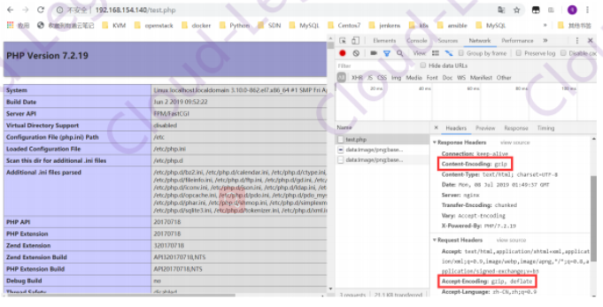

# Nginx优化及防盗链

​    在企业信息化应用环境中，服务器的安全性和响应速度需要根据实际情况进行相应参数配置,以达到最优的用户体验。默认的Nginx安装参数只能提供最基本的服务，需要调整如网页缓存时间、连接超时、网页压缩等相应参数，发挥出服务器的最大作用。


## 1、隐藏版本等信息

在生产环境中，需要隐藏Nginx的版本号， 以避免泄漏Nginx的版本， 使攻击者不能针对特定版本进行攻击。
优化前访问:

```http
HTTP/1.1 200 OK
server: nginx/1.16.0	#版本信息
Date: Thu, 04 Jul 2019 15:06:57 GMT
Content-Type: text/html; charset=utf-8
Content-Length: 626
Last-Modified: Mon， 01 Jul 2019 09:26:46 GMT
Connection: keep-alive
ETag: "5d19d1d6-272"
Accept-Ranges: bytes
```

### 优化方式

- 修改主配置文件

  将Nginx的配置文件中的server_tokens选项值设置为off,如没有该配置项,加上即可。

  ```nginx
  http {
  include		 mime.types;
  default_type application/octet-stream;
  server_tokens off ;
  …………	#省略很多内容
  }
  ```
  

使用了php处理动态网页,如果php配置文件中配置了fastcgi_param SERVER_SOFTWARE选项,则编辑php-fpm配置文件，将fastcgi_param SERVER_SOFTWARE对应的值修改为fastcgi_param SERVER_SOFTWARE nginx。

重启服务后，再次查看：

```shell
  $ curl -I http://127.0.0.1
  HTTP/1.1 200 OK
  Server: nginx
  Date: Tue, 21 Apr 2020 14:35:15 GMT
  Content-Type: text/html
  Content-Length: 612
  Last-Modified: Tue, 21 Apr 2020 13:35:13 GMT
  Connection: keep-alive
  ETag: "5e9ef691-264"
  Accept-Ranges: bytes
```


- **编译安装前修改源码**

  编译前的优化主要是用来修改程序名等等，目的更改源码隐藏软件名称和版本号。

  1.进入解压后的源码目录,进行修改

  ​	修改前

  ```shell
  $ vim src/core/nginx.h
  #define NGINX_VERSION	   "1.16.0"	  #定义的版本号
  #define NGINX_VER		  "nginx/" NGINX_VERSION  #定义的软件名称
  ```

  ​	修改后

  ```shell
  $ vim src/core/nginx.h
  #define NGINX_VERSION		"7.0"
  #define NGINX_VER			"IIS/" NGINX_VERSION
  ```

  2、修改HTTP头信息中的connection字段，防止回显具体版本号

  拓展:通用http头,通用头包含请求和响应消息都支持的头，通用头包含Cache-Control、Connection、Date、 Pragma、 Transfer-Encoding、 Upgrade、 Via。 对通用头的扩展要求通讯双方都支持此扩展，如果存在不支持的通用头, 一般将会作为实体头处理。那么也就是说有部分设备或者是软件能获取到connection， 要隐藏就要彻底!

  ​	修改前：

  ```shell
  $ vim src/core/nginx.h
  static u_char ngx_http_error_tail[] =
  "<hr><center>nginx</center>" CRLF
  "</body>" CRLF
  '</html>" CRLF
  ;
  ```
  

修改后：

```html
  static u_char ngx_http_error_tail[] =
  "<hr><center>IIS</center>" CRLF
  "</body>" CRLF
  "</html>" CRLF
  ;
```

修改完毕后进行编译安装，安装完成后,查看测试:

```shell
  $ curl -I http://127.0.0.1
  HTTP/1.1 200 OK
  Server: IIS/7.0 
  …………		#省略很多内容
```


## 2、工作进程数优化

Nginx默认只开启一个worker进程， 一般都设置为CPU个数，查看CPU个数使用如下命令:

```shell
$ grep -C 'processor' /proc/cpuinfo
4
```

所以应该配置成：

```nginx
worker_processes 4;
worker_cpu_affinity 0001 0010 0100 1000; #将每个工作进程绑定到单独的CPU
worker_rlimit_nofile 65535; #工作进程打开的最大文件数
```

也可以这样调整(1.9.0版本后)

```nginx
worker_processes auto;
worker_cpu_affinity auto;
#1.9.10版本后允许将工作进程自动绑定到可用的CPU
```

打开的最大文件数还要和系统的一致，使用ulimit -n查看，如果不一致,需要调整

```shell
$ vim /etc/security/limits.conf
* soft nofile 65535
* hard nofile 65535
* soft noproc 65535
* hard noproc 65535
```

## 3、Nginx事件处理模型

```nginx
events {
	use epoll;
	worker_connections 8192;
	accept_mutex on;
	multi_accept on;
}
```

nginx采用epolI事件模型，处理效率高。

work_connections是单个worker进程允许客户端最大连接数,这个数值一般根据服务器性能和内存来制定，实际最大值就是worker进程数乘以work_connections

accept_mutex（ [əkˈsept]  //,mjuː ˈtɛks//）如果启用on,工作进程将轮流接受新的连接。否则，将通知所有工作进程有关新连接的信息,但只有一个进程可以获得连接。如果新连接的数量较低，则某些工作进程可能会浪费系统资源。如果是并发连接数很大的情况，应该调整为off.新版本默认是off,在版本1.1 1.3之前，默认值为on。

multi_accept指令使得NGINX worker能够在获得新连接的通知时尽可能多的接受连接。此指令的作用是立即接受所有连接放到监听队列中。如果指令被禁用, worker进程将逐个接受连接。默认是off。


## 4、开启高效传输模式

```nginx
http {
	include			mime.types;
	default_type 	application/octet-stream;
	sendfile		on;
	tcp_nopush		on;
	}
```

include mime.types; //媒体类型,include只是一个在当前文件中包含另一个文件内容的指令。
default_type application/octet-stream;  //默认媒体类型

sendfile on; //开启高效文件传输模式，sendfile指令指定nginx是否调用sendfile函数来输出文件，对于普通应用设为on,如果用来进行下载等应用磁盘I/0重负载应用，可设置为off, 以平衡磁盘与网络I/O处理速度，降低系统的负载。注意:如果图片显示不正常把这个改成off。当Nginx是一个静态文件服务器的时候，开启sendfile配置项能大大提高Nginx的性能。

tcp_nopush on;必须在sendfile开启模式才有效,防止网路阻塞,积极的减少网络报文段的数量(告诉nginx在一个数据包里发送所有头文件,而不是一个接一个的发送。 同tcp_nodelay选项互斥)

## 5、连接超时时间

主要目的是保护服务器资源，CPU,内存,控制连接数，因为建立连接也是需要消耗资源的

```nginx
keepalive_timeout 60;
tcp_nodelay on;
client_header_buffer_size 4k;
open_file_cache max=102400 inactive=20s;
open_file_cache_valid 30s;
open_file_cache_min_uses 1;
client_header_timeout 15 ;
client_body_timeout 15;
reset_timedout_connection on ;
send_timeout 15;
server_tokens off;
client_max_body_size 10m;
```

keepalived_timeout客户端连接保持会话超时时间,超过这个时间，服务器断开这个链接

tcp_nodelay off,会增加通信的延时,但是会提高带宽利用率。在高延时、数据量大的通信场景中应该会有不错的效果;tcp_nodelay on,会增加小包的数量,但是可以提高响应速度。在及时性高的通信场景中应该会有不错的效果;

client_header_buffer_size 4k;
客户端请求头部的缓冲区大小，这个可以根据你的系统分页大小来设置，一般一个请求头的大小不会超过1k,不过由于一般系统分页都要大于1k, 所以这里设置为分页大小。分页大小可以用命令getconf PAGESIZE取得。

open_file_cache max=102400 inactive=20s;
这个将为打开文件指定缓存，默认是没有启用的，max指定缓存数量,建议和打开文件数一致，inactive是指经过多长时间文件没被请求后删除缓存。

open_file_cache_valid 30s;这个是指多长时间检查一次缓存的有效信息。
open_file_cache_min_uses 1;open_file_cache 指令中的inactive参数时间内文件的最少使用次数，如果超过这个数字，文件描述符一直是在缓存中打开的，如上例，如果有一个文件在inactive时间内一次没被使用，它将被移除

client_header_timeout设置请求头的超时时间。我们也可以把这个设置低些，如果超过这个时间没有发送任何数据，nginx将返回request time out的错误

client_body_timeout设置请求体的超时时间。我们也可以把这个设置低些，超过这个时间没有发送任何数据，和上面一样的错误提示

reset_timeout_connection 告诉nginx关闭不响应的客户端连接。这将会释放那个客户端所占有的内存空间。

send_timeout响应客户端超时时间，这个超时时间仅限于两个活动之间的时间，如果超过这个时间，客户端没有任何活动，nginx 关闭连接

client_max_body_size.上传文件大小限制。


## 6、fastcgi调优

```nginx
fastcgi_connect_timeout 600 ;
fastcgi_send_timeout 600;
fastcgi_read_timeout 600;
fastcgi_buffer_size 64k;
fastcgi_buffers 4 64k;
fastcgi_busy_buffers_size 128k;
fastcgi_temp_file_write_size 128k;
fastcgi_temp_path /usr/local/nginx1.10/nginx_tmp;
fastcgi_intercept_errors on;
fastcgi_cache_path /usr/1ocal/nginx1.10/fastcgi_cache levels=1:2
keys_zone=cache_fastcgi:128m
inactive=1d max_size=10g;
```

fastcgi_connect_timeout 600; #指定连接到后端FastCGI的超时时间。
fastcgi_send_timeout 600; #向FastCGl传送请求的超时时间。
fastcgi_read_timeout 600; #指定接收FastCGI应答的超时时间。
fastcgi_buffer_size 64k; #指定读取FastCGI应答第一部分需要用多大的缓冲区，默认的缓冲区大小为一个内存页大小(4K或者8K)，可以将这个值设置更小。

fastcgi_buffers 4 64k; #指定本地需要用多少和多大的缓冲区来缓冲FastCGl的应答请求,如果一个php脚本所产生的页面大小为256KB,那么会分配4个64KB的缓冲区来缓存,如果页面大小大于256KB,那么大于256KB的部分会缓存到fastcgi_temp_path指定的路径中，但是这并不是好方法,因为内存中的数据处理速度要快于磁盘。一般这个值应该为站点中 php脚本所产生的页面大小的中间值，如果站点大部分脚本所生的页面大小为256KB,那么可以把这个值设置为“8 32K"、“4 64k”等。

fastcgi_busy_buffers_size 128k; #建议设置为fastcgi_buffers的两倍，繁忙时候的buffer

fastcgi_temp_file_write_size 128k; #在写入fastcgi_temp_path 时将用多大的数据块，默认值是fastcgi_ buffers的两倍,该数值设置过小时若负载上来时可能报502 Bad Gateway

fastcgi_temp_path #缓存临时目录

fastcgi_intercept_errors on;#这个指令指定是否传递4xx和5xx错误信息到客户端，或者允许nginx使用error_page处理错误信息。注:静态文件不存在会返回404页面，但是php页面则返回空白页!

fastcgi_cache_path /usr/local/nginx1.1 0/fastcgi_cache levels=1:2 keys_zone=cache_fastcgi:128m
inactive=1d.max_size=10g; # fastcgi_cache 缓存目录，可以设置目录层级，比如1:2会生成16*256个子目录，cache_fastcgi 是这个缓存空间的名字，cache 是用多少内存(这样热门的内容nginx直接放内存，提高访问速度)，inactive表示默认失效时间，如果缓存数据在失效时间内没有被访问，将被删除，max_size 表示最多用多少硬盘空间。

fastcgi_cache cache_fastcgi; #表示开启FastCGI缓存并为其指定一个名称。开启缓存非常有用，可以有效降低CPU的负载，并且防止502的错误发生。cache_fastcgi为proxy_cache_path指令创建的缓存区名称

fastcgi_cache_valid 200 302 1h;#用来指定应答代码的缓存时间,实例中的值表示将200和302应答缓存一小时，要和fastcgi. cache配合使用

fastcgi_cache. valid 301 1d; #将301应答缓存一天

fastcgi_cache_valid any 1m; #将其他应答缓存为1分钟
fastcgi_cache_min_uses 1; #该指令用于设置经过多少次请求的相同URL将被缓存。
fastcgi_cache_key http://$host$request_uri; #该指令用来设置web缓存的Key值,nginx根据Key值md5哈希存储,一-般根据$host(域名)、$request_uri(请求的路径)等变量组合成proxy_cache_key

**总结：**

nginx的缓存功能有: proxy_cache和fastcgi_cache

- proxy_cache的作用是缓存后端服务器的内容,可能是任何内容,包括静态的和动态。

- fastcgi_cache的作用是缓存fastcgj生成的内容，很多情况是php生成的动态的内容。

- proxy_cache缓存减少了nginx与后端通信的次数，节省了传输时间和后端宽带。

- fastcgi_cache缓存减少了nginx与php的通信的次数， 更减轻了php和数据库(mysql)的压力。

## 7、gzip调优

使用gzip压缩功能，可节约带宽，加快传输速度,有更好的体验,也为我们节约成本,所以说这是一个重点。Nginx启用压缩功能需要你来ngx_http_gzip_module模块，apache使用的是mod_deflate. 一般我们需要压缩的内容有:文本，js, html, Css, 对于图片,视频，flash什么的不压缩，同时也要注意,使用gzip的功能是需要消耗CPU的。

```nginx
gzip on;
gzip_min_length 2k;
gzip_buffers 4 32k;
gzip_http_version 1.1;
gzip_comp_level 6;
gzip_types text/plain text/css text/javascript application/json
application/javascript
application/x-javascript application/xml;gzip_vary on; 
gzip_proxied any;
```

gzip on; #开启压缩功能
gzip_min_length 1k; #设置允许压缩的页面最小字节数，页面字节数从header头的Content-Length中获取，默认值是20字节,建议设置成大于1K,如果小于1 K可能会越压越大。

gzip_buffers 4 32k; #压缩缓冲区大小,表示申请4个单位为32K的内存作为压缩结果流缓存,默认值是申请与原始数据大小相同的内存空间来存储gzip压缩结果。

gzip_http_version 1.1; #压缩版本，用于设置识别HTTP协议版本,默认是1.1,目前大部分浏览器已经支持GZIP解压，使用默认即可

gzip_comp_level 6; #压缩比例，用来指定GZIP压缩比，1压缩比最小，处理速度最快，9压缩比最大,传输速度快，但是处理慢，也比较消耗CPU资源。默认是1

gzip_types text/css text/xml application/javascript; #用来指定压缩的类型，'text/html类型总是会被压缩。默认值: gzip_types text/html (默认不对js/CSS文件进行压缩)

gzip_vary on;开启和关闭插入"Vary: Accept-Encoding"响应头区域

gzip_proxied any; #Nginx作为反向代理的时候启用,根据后端服务器的相应头区域是否有"Via”区域来开启或者是关闭压缩。any就是所有的代理请求都压缩。


## 8、配置网页缓存时间

当Nginx将网页数据返回给客户端后，可设置缓存的时间，以方便在日后进行相同内容的请求时直接返回，以避免重复请求，加快了访问速度，一般针对静态资源进行设置, 对动态网页不用设置缓存时间。
下面对图片做缓存配置:

```nginx
location ~ \.(gif|jpg|jpeg|png|bmp|ico)$ {		#加入新的location
		root html ;
		expires 1d;				#指定缓存时间
}
```

设置缓存一天的时间，一天之内浏览器访问这个页面， 都是用缓存中的数据，而不需要向Nginx服务器重新发出请求，减少了服务器的使用带宽。

**总结：**

**expire功能优点:**

- expires可以降低网站购买的带宽， 节约成本
- 同时提升用户访问体验
- 减轻服务的压力，节约服务器成本，是web服务非常重要的功能。
- **expire功能缺点:**
- 被缓存的页面或数据更新了,用户看到的可能还是旧的内容,反而影响用户体验。
- 解决办法:
  。第一个缩短缓存时间，例如: 1天,但不彻底，除非更新频率大于1天;
  。第二个对缓存的对象改名。
- 网站不希望被缓存的内容:
  。网站流量统计工具
  。更新频繁的文件(google的logo)


## 9、防盗链

在企业网站服务中，一般都要配置防盗链功能，以避免网站内容被非法盗用，造成经济损失，也避免了不必要的带宽浪费。Nginx的防盗链功能也非常强大，在默认情况下，只需要进行很简单的配置，即可实现防盗链处理。

```nginx
location ~* \.(jpg|gif|swf)$ {
    valid_referers none blocked web.test.cn;
    if ($invalid_referer) {
        rewrite ^/ http://web.test.cn/meinv02.jpg;
    }
    root   /usr/share/nginx/html/web;
}
```

Nginx的防盗链原理是加入location项，用正则表达式过滤图片类型文件,对于信任的网址可以正常使用，不信任的网址返回相应的错误图片。

## 10、内核参数优化

fs.file-max = 999999:

这个参数表示进程(比如一个worker进程)可以同时打开的最大句柄数，这个参数直线限制最大并发连接数，需根据实际情况配置。

net.ipv4.tcp_max_tw_buckets = 6000

这个参数表示操作系统允许TIME_WAIT套接字数量的最大值,如果超过这个数字，TIME_WAIT套接字将立刻被清除并打印警告信息。该参数默认为180000,过多的TIME_WAIT套接字会使Web服务器变慢。
注:主动关闭连接的服务端会产生 TIME_WAIT状态的连接

net.ipv4.ip_local_port_range = 1024 65000
允许系统打开的端口范围

net.ipv4.tcp_tw_recycle= 1
启用timewait快速回收

net.ipv4.tcp_tw_reuse= 1
开启重用。允许将TIME-WAIT sockets重新用于新的TCP连接。这对于服务器来说很有意义,因为服务器上总会有大量TIME-WAIT状态的连接。

net.ipv4.tcp_keepalive_time= 30
这个参数表示当keepalive启用时，TCP发送keepalive消息的频度。默认是2小时,若将其设置的小一些，可以更快地清理无效的连接。

net.ipv4.tcp_syncookies= 1
开启SYN Cookies当出现SYN等待队列溢出时，启用cookies来处理。该参数与性能无关，用于解决TCP的SYN攻击。

net.core.somaxconn = 40960
somaxconn参数:定义了系统中每一个端口最大的监听队列的长度，这是个全局的参数默认值为128，对于一个经常处理新连接的高负载web服务环境来说，默认的128太小了。大多数环境这个值建议增加到1024或者更多。大的侦听队列对防止拒绝服务DoS攻击也会有所帮助。
web应用中listen函数的backlog默认会给我们内核参数的net.core.somaxconn限制到128,而nginx定义的NGX_LISTEN_BACKLOG 默认为511,所以有必要调整这个值。
注:对于一 个TCP连接, Server与Client需要通过三次握手来建立网络连接.当三次握手成功后,我们可以看到端口的状态由LISTEN转变为ESTABLISHED（ [ɪˈstæblɪʃt] 建立），接着这条链路上就可以开始传送数据了。每一个处于监听(Listen)状态的端口,都有自己的监听队列.监听队列的长度与此somaxconn参数和使用该端口的程序中listen()函数有关

net.core.netdev_max_backlog = 262144
每个网络接口接收数据包的速率比内核处理这些包的速率快时，允许送到队列的数据包的最大数目。

net.ipv4.tcp_max_syn_backlog = 262144
这个参数标示TCP三次握手建立阶段接受SYN请求队列的最大长度,默认为1024,将其设置得大一些可以使出现Nginx繁忙来不及accept新连接的情况时，Linux 不至于丢失客户端发起的连接请求。

net.ipv4.tcp_rmem = 10240 87380 12582912
这个参数定义了TCP接受缓存(用于TCP接受滑动窗口)的最小值、默认值、最大值。

net.ipv4.tcp_wmem = 10240 87380 12582912
这个参数定义了TCP发送缓存(用于TCP发送滑动窗口)的最小值、默认值、最大值。

net.core.rmem_default = 6291456
这个参数表示内核套接字接受缓存区默认的大小。

net.core.wmem_default = 6291456
这个参数表示内核套接字发送缓存区默认的大小。

net.core.rmem_max= 12582912
这个参数表示内核套接字接受缓存区的最大大小。

net.core.wmem_max = 12582912
这个参数表示内核套接字发送缓存区的最大大小。

### 内核优化案例

```nginx
fs.file-max = 99999
net.ipv4.ip_forward = 0
net.ipv4.conf.default.rp_filter = 1
net.ipv4.conf.default.accept_source_route = 0
kernel.sysrq = 0
kernel.core_uses_pid = 1
net.ipv4.tcp_syncookies = 1
kernel.msgmnb = 65536
kernel.msgmax = 65536
kernel.shmmax = 68719476736
kernel.shmall = 4294967296
net.ipv4.tcp_max_tw_buckets = 6000
net.ipv4.tcp_sack = 1
net.ipv4.tcp_window_scaling = 1
net.ipv4.tcp_rmem = 10240 87380 12582912
net.ipv4.tcp_wmem = 10240 87380 12582912
net.core.wmem_default = 8388608
net.core.rmem_default = 8388608
net.core.rmem_max = 16777216
net.core.wmem_max = 16777216
net.core.netdev_max_backlog = 262144
net.core.somaxconn = 40960
net.ipv4.tcp_max_orphans = 3276800
net.ipv4.tcp_max_syn_backlog = 262144
net.ipv4.tcp_timestamps = 0
net.ipv4.tcp_synack_retries = 1
net.ipv4.tcp_syn_retries = 1
net.ipv4.tcp_tw_recycle = 1
net.ipv4.tcp_tw_reuse = 1
net.ipv4.tcp_mem = 94500000 915000000 927000000
net.ipv4.tcp_fin_timeout = 1
net.ipv4.tcp_keepalive_time = 30
net.ipv4.ip_local_port_range = 1024 65000
```

执行sysctl -p 使内核修改生效

### 实验优化案例

**部署实验环境**

1、部署LNMP环境(略)

2、一个完整的Nginx配置文件案例

```nginx
user www www;
worker_processes 4 :
worker_cpu_affinity 0001 0010 0100 1000;
worker_rlimit_nofile 65535;
error_log logs/error.log;
#error_log logs/error.log notice; 
#error_log logs/error.log info; 
pid logs/nginx.pid;
events {
	use epoll;
	worker_connections 8192;
	multi_accept on;
}
http {
	include mime.types;
	default_type application/octet-stream; 
	log_format main '$remote_addr - $remote_user [$time_local] "$request" '
				   '$status $body_bytes_sent ”$http_referer'
				   '"$http_user_agent" "Shttp_x_forwarded_for"';
	#access_log logs/access.log main;
	sendfile on;
	tcp_nopush on;
	keepalive_timeout 65;
	tcp_nodelay on;
	client_header_buffer_size 4k;
	open_file_cache max=102400 inactive=20s ;
	open_file_cache_valid 30s;
	open_file_cache_min_uses 1
	client_header_timeout 15;
	client_body_timeout 15;
	reset_timedout_connection on;
	send_timeout 15;
	server_tokens off;
	client_max_body_size 10m;
	fastcgi_connect timeout 600;
	fastcgi_send timeout 600;
	fastcgi_read timeout 600;
	fastcgi_buffer_size 64k;
	fastcgi_buffers 4 64k;
	fastcgi_busy_buffers_size 128k;
	fastcgi_temp_file_write_size 128k;
	fastcgi_temp path /usr/local/nginx1.10/nginx_tmp;
	fastcgi_intercept_errors on;
	fastcgi_cache_path /usr/local/nginx1.10/fastcgi_cache levels=1:2
	keys_zone=cache_fastcgi:128m inactive=1d max_size=10g;
	gzip on;
	gzip_min_length 2k;
	gzip_buffers 4 32k;gzip_http_version 1.1;
	gzip_comp_level 6;
	gzip_types text/plain text/css text/javascript application/json
application/javascript
application/x-javascript application/xml ;
	gzip_vary on;
	gzip_proxied any;
server {
	listen 80; 
	server_name www.shengzhe.com; 
	#charset koi8-r;
	#access_log logs/host.access.log main;
	location ~* ^.+\.(jpg|gif|png|swf|flv|wma|wmv|asf|mp3|mmf|zip|rar)${
		valid_referers none blocked www.shengzhe.com shengzhe.com;
			if ($invalid_referer) {
				#return 302 http://www.shengzhe.com/img/nolink.jpg;
				return 404;
				break;
				}
			access_log off;
			}
		location / {
			root html;
			index index.php index.html index.htm;
			}
		location ~* \.(ico|jpeg|gif|png|bmp|swf|flv)$ {
			expires 30d;
			#log_not_found off;
			access_log off;
			}
		location ~* \.(js|css)$ {
			expires 7d;
			log_not_found off;
			access_log off;
			}
		location = /(favicon.ico|roboots.txt) {
			access_log off;
			log_not_found off;
			}
		location /status {
			stub_status on;
		location ~ . *\.(php|php5)?$ {
			root html;
			fastcgi_pass 127.0.0.1:9000;
			fastcgi_index index.php;
			include fastcgi.conf;
			fastcgi_cache cache_fastcgi;
			fastcgi_cache_alid 200 302 1h;
			fastcgi_cache_valid 301 1d;
			fastcgi_cache_valid any 1m;
			fastcgi_cache_min_uses 1;
			fastcgi_cache_use_stale error timeout invalid_header http_500;
			fastcgi_cache_key http://$host$request_uri;
		#error_page 404 /404.html;
		# redirect server error pages to the static page /50x.html
		#
		error_page 500 502 503 504 /50x.html;
		location = /50x.html {
			root html ;
			}
		}
	}

```

### 验证、压力测试

#### **1.验证防盗链**

使用Apache做为一个测试站点，域名为www.test.com,在测试页上做一个超链接， 链接nginx站点的一张图片

```shell
$ cat /var/www/html/index.html
<a href="http://www.shengzhe.com/11.gif">lianjie</a>
```

Nginx站点的网页目录结如下:

```shell
$ tree -C /usr/local/nginx1.16/html/
/usr/local/nginx1.16/html/
├── 11.gif
├── 50x.html
├── img
│       └── nolink.jpg
├── index.html
├── mysql_test.php
└── test.php

1 directory, 6 files
```

在客户端浏览器中输入:www.test.com


点击页面链接，可以看到防盗链设置已经生效


#### **2.验证gzip功能**

使用谷歌浏览器测试访问，如下图显示结果: (提示: 在访问测试页之前按F12键)



用户访问test.php文件， 在上图中content-encoding:gzip表明响应给用户的数据是压缩传输。

#### 3.压力测试

网站性能压力测试是服务器网站性能调优过程中必不可缺少的一环。只有让服务器处在高压情况下，才能真正体现出软件、硬件等各种设置不当所暴露出的问题。

性能测试工具目前最常见的有以下几种: ab、http_load、webbench、siege。
ab是apache自带的压力测试工具。ab非常实用，它不仅可以对apache服务器进行网站访问压力测试，也可以对或其它类型的服务器进行压力测试。比如nginx、tomcat、 llS等。
需要安装才能使用:

```shell
$ yum install httpd-tools -y
```

最常用的参数:

```shell
-n	总的要执行多少个请求数
-C	一次要发出的请求数(并发数)
```

执行以下测试命令

```shell
$ ab -C 500 -n 50000 http://192.168.154.140/index.html
This is ApacheBench, version 2.3 <$Revision: 1430300 $>
Copyright 1996 Adam Twiss，Zeus Technology Ltd，http://www.zeustech.net/
Licensed to The Apache Software Foundation, http://www.apache.org/
Benchmarking 192.168.154.140 (be patient)
Completed 5000 requests
Completed 10000 requests
Completed 15000 requests
Completed 20000 requests
Completed 25000 requests
Completed 30000 requests
Completed 35000 requests
Completed 40000 requests
Completed 45000 requests
Completed 50000 requests
Finished 50000 requests

Server Software:	nginx
Server Hostname :	192.168.154.140
Server Port:		80

Document Path:		/index.html
Document Length:	626 bytes

concurrency Level:		500
Time taken for tests:	32.916 seconds
Complete requests:		50000
Failed requests :		12
	(Connect: 0，Receive: 0，Length: 6，Exceptions: 6)
write errors:			0
Total transferred: 		42600000 bytes
HTML transferred:		31300000 bytes
Requests per second:	1519.01 [#/sec] (mean)
Time per request:		329.161 [ms] (mean)
Time per request:		0.658 [ms] (mean， across a11 concurrent requests )
Transfer rate:			1263.87 [Kbytes/sec] received

Connection Times (ms )
			min	mean[+/-sd]	median	max
Connect :	   0  85  26.8     83    367
Processing:	   8  95  168.8    92  15002
waiting:       2  64  28.5     59    374
Total :		  82 181 168.5    172  15002

Percentage of the requests served within a certain time (ms)
50%		172
66%		179
75%		184
80%		187
90%		198
95%		209
98%		250
99%		370
100% 	15002 (longest request)
```

**ab性能指标**

1、吞吐率(Requests per second)

服务器并发处理能力的量化描述，单位是reqs/s, 指的是在某个并发用户数下单位时间内处理的请求数。某个并发用户数下单位时间内能处理的最大请求数,称之为最大吞吐率。

记住:吞吐率是基于并发用户数的。这句话代表了两个含义:

- 吞吐率和并发用户数相关
- 不同的并发用户数下,吞吐率一般是不同的

计算公式:总请求数/处理完成这些请求数所花费的时间，即
Request per second=Complete requests/Time taken for tests
必须要说明的是，这个数值表示当前机器的整体性能，值越大越好。

2.并发连接数(The number of concurrent connections)

并发连接数指的是某个时刻服务器所接受的请求数目,简单的讲，就是一个会话

3.并发用户数(Concurrency Level)

要注意区分这个概念和并发连接数之间的区别，一个用户可能同时会产生多个会话，也即连接数。在HTTP/1.1下，IE7支持两个并发连接，IE8支持6个并发连接， FireFox3支持4个并发连接,所以相应的，我们的并发用户数就得除以这个基数。

4.用户平均请求等待时间(Time per request)

计算公式:处理完成所有请求数所花费的时间/ (总请求数/并发用户数)，即:

Time per request=Time taken for tests/ (Complete requests/Concurrency Level)

5.服务器平均请求等待时间(Time per request:across all concurrent requests)

计算公式:处理完成所有请求数所花费的时间/总请求数,即:

Time taken for/testsComplete requests

可以看到，它是吞吐率的倒数。

同时，它也等于用户平均请求等待时间/并发用户数,即

Time per request/Concurrency Level

**第二次压力测试，比较两次的差异**

```shell
$ ab -C 1000 -n 10000 http://192.168.154.140/index.html
This is ApacheBench，version 2.3 <SRevision: 1430300 $>
Copyright 1996 Adam Twiss，Zeus Technology Ltd, http://www.zeustech.net/
Licensed to The Apache software Foundation, http://www.apache.org/

Benchmarking 192.168.154.140 (be patient)
Completed 10000 requests
Completed 20000 requests
Completed 30000 requests
Completed 40000 requests
Completed 50000 requests
Completed 60000 requests
Completed 70000 requests
Completed 80000 requests
Completed 90000 requests
Completed 100000 requests
Finished 100000 requests

Server Software:	nginx
Server Hostname :	192.168.154.140
Server Port:		80

Document Path:		/index.html
Document Length:	626 bytes

concurrency Level:		1000
Time taken for tests:	50.908 seconds
Complete requests:		10000
Failed requests :		39
	(Connect: 0，Receive: 0，Length: 6，Exceptions: 6)
write errors:			0
Total transferred: 		85200000 bytes
HTML transferred:		62600000 bytes
Requests per second:	1964.33 [#/sec] (mean)
Time per request:		509.080 [ms] (mean)
Time per request:		0.658 [ms] (mean， across a11 concurrent requests )
Transfer rate:			1634.38 [Kbytes/sec] received


Connection Times (ms )
			min	mean[+/-sd]	median	 max
Connect :	   0  173  	50.7    171   638
Processing:	  16  189  211.9    183  15010
waiting:       3  122   54.4    115    472
Total :		 191  361  207.8    349  15010

Percentage of the requests served within a certain time (ms)
50%		349
66%		359
75%		366
80%		371
90%		385
95%		400
98%		461
99%		603
100% 	15010 (longest request)
```

#### 4.opcache提高PHP访向速度

Opcache的前生是Optimizer+（ [ˈɑptəˌmaɪzər]优化器 ）,它是PHP的官方公司Zend开发的一款闭源但可以免费使用的PHP优化加速组件。Optimizer+将PHP代码预编译生成的脚本文件Opcode缓存在共享内存中供以后反复使用，从而避免了从磁盘读取代码再次编译的时间消耗。同时，它还应用了一些代码优化模式，使得代码执行更快。从而加速PHP的执行。
安装

```shell
$ yum install php72w-opcache -y
```

官方推荐配置

```nginx
opcache.enable=1
opcache.memory_consumption=128
opcache.interned_strings_buffer=8
opcache.max_accelerated files=4000
opcache.revalidate_freq=60
opcache.fast_shutdown=1
opcache.enab1e_cli=1
```

测试PHP动态页面

```shell
$ ab -C 1000 -n 100000 http://192.168.154.140/test.php
This is ApacheBench，version 2.3 <$Revision: 1430300 $>
Copyright 1996 Adam Twiss，Zeus Technology Ltd，http://www.zeustech.net/
Licensed to The Apache software Foundation, http://www.apache.org/

Benchmarking 192.168.154.140 (be patient)
Completed 10000 requests
Completed 20000 requests
Completed 30000 requests
Completed 40000 requests
Completed 50000 requests
Completed 60000 requests
Completed 70000 requests
Completed 80000 requests
Completed 90000 requests
Completed 100000 requests
Finished 100000 requests

Server Software:	nginx
Server Hostname :	192.168.154.140
Server Port:		80

Document Path:		/text.php
Document Length:	73746 bytes

concurrency Level:		1000
Time taken for tests:	43.004 seconds
Complete requests:		10000
Failed requests :		0
write errors:			0
Total transferred: 		7392500000 bytes
HTML transferred:		7371600000 bytes
Requests per second:	2325.39 [#/sec] (mean)
Time per request:		430.036 [ms] (mean)
Time per request:		0.430 [ms] (mean， across a11 concurrent requests )
Transfer rate:			167875.33 [Kbytes/sec] received


Connection Times (ms)
			min	mean[+/-sd]	median	 max
Connect :	   1   78  	54.3     67   524
Processing:	  38  350   80.6    343   824
waiting:       1   51   33.8     44   404
Total :		 112  428   77.3    409   899

Percentage of the requests served within a certain time (ms)
50%		405
66%		420
75%		435
80%		449
90%		504
95%		595
98%		694
99%		767
100% 	899 (longest request)
```

