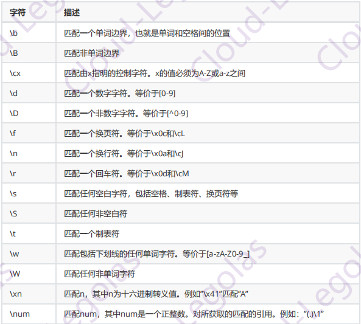

# Nginx Rewrite

现在Nginx已经成为很多公司作为前端反向代理服务器的首选，在实际工作中往往会遇到很多跳转(重写URL)的需求。比如更换域名后需要保持旧的域名能跳转到新的域名上、某网页发生改变需要跳转到新的页面、网站防盗链等等需求。如果在后端使用的Apache服务器， 虽然也能做跳转,规则库也很强大，但是用Nginx跳转效率会更高，这也是学习本章的目的所在。

## Rewrite前置知识

### 1、Rewrite跳转场景

Rewrite跳转场景主要包括以下几种:

​        1.可以调整用户浏览的URL,看起来更规范，合乎开发及产品人员的需求;

​        2.为了让搜索引擎搜录网站内容及用户体验更好，企业会将动态URL地址伪装成静态地址提供服务;

​        3.网址换新域名后，让旧的访问跳转到新的域名上。例如，访问京东的360buy.com会跳转到jd.com;

​        4.根据特殊变量、目录、客户端的信息进行URL调整等。

### 2、Rewrite跳转实现

Nginx 是通过ngx_http_rewrite_module模块支持url重写、支持if条件判断，但不支持else。另外该模块需要PCRE支持，应在编译Nginx时指定PCRE（PCRE库支持正则表达式）支持，默认已经安装。根据相关变量重定向和选择不同的配置，从一个location跳转到另一个location, 不过这样的循环最多可以执行10次，超过后Nginx将返回500错误。同时，重写模块包含set指令，来创建新的变量并设其值，这在有些情景下非常有用的，如记录条件标识、传递参数到其他location.记录做了什么等等。rewrite功能就是， 使用Nginx提供的全局变量或自己设置的变量，结合正则表达式和标志位实现url 重写以及重定向。

### 3、Rewrite实际场景

在实际工作场景，Nginx跳转需求有三种方式可实现。可以直接用rewrite进行匹配跳转，也可以使用if匹配全局变量后跳转，另外还可以使用location匹配再跳转，所以rewrite只能放在server{}, if{},location{}段中，例如location只能对域名后边的除去传递的参数外的字符串起作用，例如http://www.domain.com/index.php?id=1只对/index.php重写。如果想对域名或参数字符串起作用，可以使用if全局变量匹配，也可以使用proxy_ pass反向代理。

## Rewrite必备知识

### 1、正则表达式

学习Rewrite之前要对正则表达式要很熟悉，下表中列举出一些常用的正则表达式元字符。要深刻理解和学习每个元字符的含义，并且多动手进行实验，在实际生产环境中要结合多个元字符一起使用。



### 2、Rewrite语法

```nginx
Syntax: rewrite regex replacement [flag] ; 
Default: -
Context: server, location,if
```

如果regex匹配了一个请求的URI,该URI被替换为replacement（[rɪˈpleɪsmənt] 替换）。 rewrite 指令在配置文件中按照出现的顺序执行。可使用flag中止进一步的处理。如果replacement以"http://","https://"为起始的字符串，将中止处理，并返回重定向指令给客户端。

flag参数的值可以为:

- last停止当前ngx_http.rewrite_module模块指令集的处理, 并为修改后的URI寻找新的匹配的location
- break停止当前ngx_http.rewrite.module模块指令集的处理，与break（重定向模块中的break）指令作用相同，本条规则匹配完成即终止，不再匹配后面的任何规则
- redirect返回302代码的临时重定向,当replacement不以"httpt://","https://“为起始的字符串时使用。浏览器地址会显示跳转后的URU地址，爬虫不会更新url (因为是临时)
- permanent返回301代码的永久重定向。浏览器地址栏会显示跳转后的URL地址,爬虫更新url。

如果后面不跟flag标记，那么默认是302临时重定向。在实际工作场景中，还有另一种return指定。因为301和302不能简单的只返回状态码，还必须有重定向的URL,这就是return指令无法返回301 ,302的原因了。

例子:

```nginx
server{
	...
	rewrite ^(/download/.*)/media/(.*)\..*$ $1/mp3/$2.mp3 last;
	rewrite ^(/download/.*)/audio/(.*)\..*$ $1/mp3/$2.ra  last;
	return 403 ; 
	...
}
```

但如果这些指令被放入"/download" location区块中，应将last flag替换为break,否则nginx会不断循环，达到10次后，返回500 error

```nginx
location /download {
	...
	rewrite ^(/download/.*)/media/(.*)\..*$ $1/mp3/$2.mp3 break;
	rewrite ^(/download/.*)/audio/(.*)\..*$ $1/mp3/$2.ra  break;
	return 403 ; 
	...
}
```

last一般写在server和if中，而break一般使用在location中。last不终止重写后的url匹配， 即新的url会再从server走一遍匹配流程， 而break终止重写后的匹配。

如果replacement包含请求参数，原来的请求参数将被追加在后面。如果不希望追加原来的请求参数,可在replacement字符串的末尾添加一个"?”符号， 例如:

```nginx
rewrite ^/users/(.*)$ /show?user=$1? last;
```

### 3、location

```nginx
Syntax: location [ = | ~ | ~*| ^~] uri { ... }
	location @name { ... }
Default: -
Context: server, location
```

根据请求的URI设置配置。在一个server中location配置段可存在多个,用于实现URI到文件系统的路径映射;

匹配字符串分为两种:普通字符串(literal string)和正则表达式(regular expression)，其中~和~*用于正则表达式，其他前缀和无任何前缀都用于普通字符串。

@用来定义一个命名location。主要用于内部重定向，不能用来处理正常的请求。其用法如下：

```nginx
location / {
    try_files $uri $uri/ @custom
}
location @custom {
    # ...do something
}
```

上例中，当尝试访问url找不到对应的文件就重定向到我们自定义的命名location（此处为custom）。**值得注意的是，命名location中不能再嵌套其它的命名location**。

匹配顺序是: 

1.先匹配普通字符串，将最精确的匹配暂时存储;
2.然后按照配置文件中的声明顺序进行正则表达式匹配，只要匹配到一条正则表达式，则停止匹配,取正则表达式为匹配结果;
3.如果所有正则表达式都匹配不上,则取1中存储的结果;
4.如果普通字符串和正则表达式都匹配不上,则报404 NOT FOUND
5.“^~“和"=“都能阻止继续搜索正则location。不同点是“^~”依然遵守“最大前缀”匹配规则，然而“=”不是“最大前缀"，而是必须是严格匹配
6.只要遇到'精确匹配exact match”,即使普通location没有带"=”或”^~“前缀，也一样会终止后面的匹配。例如:

```nginx
location = /uri         =开头表示精确前缀匹配，只有完全匹配才能生效。
location ^~ /uri        ^~开头表示普通字符串匹配上以后不再进行正则匹配。
location ~ pattern      ~开头表示区分大小写的正则匹配。
location ~* pattern      ~*开头表示不区分大小写的正则匹配。
location /uri           不带任何修饰符，表示前缀匹配。
location /              通用匹配，任何未匹配到其他location的请求都会匹配到。
```

配置举例：

```nginx
location = / {
	[ configuration A ]
}

location / {
	[ configuration B ]
}

location /documents/ {
	[ configuration C ]
}

location ^~ /images/ {
	[ configuration D ]
}

location ~* \. (gif|jpg|jpeg)$ {
	[ configuration E ]
}

#“/”请求匹配configuration A:
#“/index. html"请求匹配configuration B:
#"/documents/ document.html"请求匹配configuration C:
#"/images/1.gif"请求匹配configuration D:
#"/documents/1.jpg"请求匹配configuration E.

#注意:正则匹配会根据匹配顺序，找到第一个匹配得正则表达式后将停止搜索。
#普通字符串匹配则无视顺序，只会选择最精确的匹配。
```

注:从功能看rewrite和location似乎有 点像，都能实现跳转,主要区别在于rewrite是在同一域名内更改获取资源的路径，而location是对一类路径做控制访问或反向代理，还可以proxy_pass到其他机器。很多情况下rewrite也会写在location里。

## Rewrite配置案例

### YUM安装Nginx

安装完成后，修改配置文件(/etc/nginx/conf.d/default.conf )如下:

```nginx
server {
        listen   80;
        server_name www.domain.com ;

        #charset koi8-r;
        access_log /var/log/nginx/www.domain.com-access.log main;

        location / {
                root /opt/nginx/html;
                index index.html index.htm;
        }
    ......#省略部分内容
}

```

注意事项:做每一步场景测试之前请确定这个域名可以正常解析，每做下一个场景之前请删除上一个场景的配置，另外清除浏览器缓存。

### 基于域名的跳转

现在公司旧域名www.domain.com有业务需求有变更，需要使用新域名www.newdomain.com代替,但是旧域名不能废除，需要跳转到新域名上,而且后面的参数保持不变。

在/etc/nginx/conf.d/default.conf 文件里的location下面添加如下内容:

```nginx
server {
    listen   80;
    server_name www.newdomain.com www.domain.com ;

    #charset koi8-r;
    access_log /var/log/nginx/www.domain.com-access.log main;

    location / {
         root /opt/nginx/html;
         index index.html index.htm;
         if ($host = 'www.domain.com'){
             rewrite ^/(.*) http://www.newdomain.com/$1 permanent;
         }
    }
    
}
```

修改配置文件后，重启nginx服务

使用客户端浏览器访问旧域名，域名直接跳转,按F12可以清楚的看到从旧域名www.domain.com跳转到了新域名www.newdomain.com上，状态码是301永久重定向。


域名后面加参数跳转，因为在代码中很多的请求是带参数的,所以要保证参数都能正常跳转。浏览器输入模拟访问http://www.domain.com/test/1/index.php(虽然这个请求内容是不存在的)跳转到http://www.newdomain.com/test/1/index.php，从headers里面可以看到301实现了永久重定向跳转，而且域名后的参数也正常跳转。


### 基于客户端IP访问跳转

例如今天公司业务版本上线，所有IP访问任何内容都显示-一个固定维护页面，只有公司P访问正常。

在/etc/nginx/conf.d/default.conf文件里添加如下内容

```nginx
server {
    listen   80;
    server_name www.newdomain.com www.domain.com ;

    #charset koi8-r;
    access_log /var/log/nginx/www.domain.com-access.log main;

    #下面是添加的内容
    set $rewrite true;
    
    if ($remote_addr = '192.168.154.1') {
        set $rewrite false;
    }
    if ($rewrite = true) {
        rewrite (.+) /maintenance.html;
    }
    
    location = /maintenance.html {
		root /opt/nginx/html;
	}
    
   ......#省略很多内容 
    
}
$ echo 'Website is Maintaining， Please visit later !’> /opt/nginx/html/maintenance.html
$ systemctl restart nginx
```

只有IP为192.1 68.154.1能正常访问，其它地址都是维护页面，使用-一个局域网的其它IP地址用浏览器访问http://www.domain.com域名和加参数都是请求的maintenance.html页面的内容，而且状态码是200


### 基于旧域名跳转到新域名后面加目录

例如现在访问的是http://bbs.domain.com,现在需要将这个域名下面的发帖都跳转到http://www.domain.com/bbs，注意保持域名跳转后的参数不变。

修改/et/nginx/conf. d/default.conf配置文件如下：

```nginx
server {
    listen   80;
    server_name www.newdomain.com www.domain.com bbs.domain.com;

    #charset koi8-r;
    access_log /var/log/nginx/www.domain.com-access.log main;

    location / {
         root /opt/nginx/html;
         index index.html index.htm;
         if ($host = 'www.domain.com'){
             rewrite ^/(.*) http://www.newdomain.com/$1 permanent;
         }
    }
    
    location /post {
        rewrite (.+) http://www.domain.com/bbbs$1 permanent;
    }
    
}
```

模拟使用浏览器访问http://bbs.domain.com/post/1 .php ,跳转到http://www.ewdomain.com/bbs/post/1.php


### 基于参数匹配的跳转

例如现在访问hp://www.domain.com/100-100|200)-100.html跳转到http://www.domain.com页面

编辑/etc/nginx/conf. d/default.conf文件里添加如下内容:

```nginx
location ~* /100-(100|200)-(\d+).html$ {
    rewrite (.*) http://www.domain.com permanent;
}
```

重启服务器后，使用浏览器访问http://www domain.com/100-200-100.html 


### 基于目录下所有php结尾的文件跳转

访问http://www.domain.com/upload/1.php跳转到首页

编辑/etc/nginx/conf. d/default.conf文件里添加如下内容:

```nginx
location ~* /upload/.*\.php$ {
	rewrite (.+) http://www.domain.com permanent;
}
```

重启服务，浏览器访问http://www.domain.com/upload/1.php即可实现跳转

### 基于最普通一条url请求的跳转,访问一个具体的页面跳转到首页

编辑/etc/nginx/conf.d/default.conf文件里添加如下内容:

```nginx
location ~* ^/1/test.html {
	rewrite (.+) http://www.domain.com permanent;
}
```

重启服务后，浏览器访问http://www.domain.com/1/test.html跳转到首页

### 总结

关于Nginx rewrite本章的内容就这么多。其实在实际工作中远远不止这些场景，而且会更加复杂繁琐，希望同学们能举一反三，多加练习。